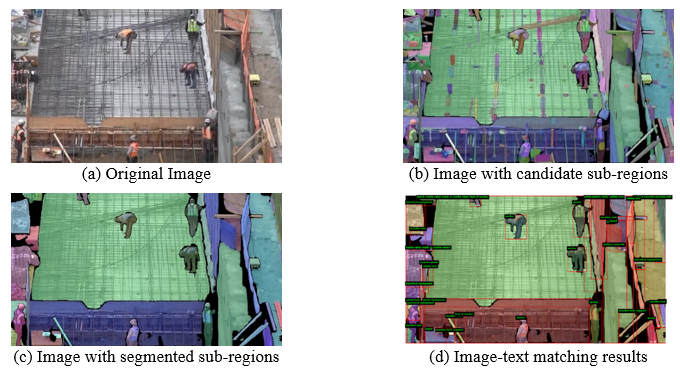
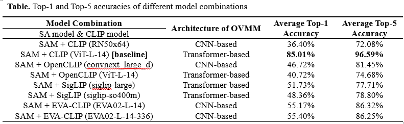
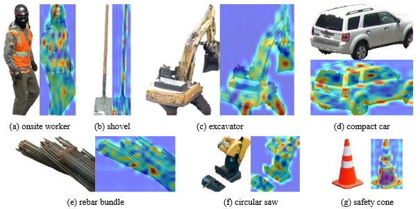

# Open Vocabulary Multimodal Model-based Zero-Shot Detection for Broader Object in Construction Site Images

[TOC]

## Project Introduction

This project combined two deep-learning modules, SAM and CLIP, for enabling the recognition of broader semantics in onsite images. Additionally, this project also includes (1) an analysis of the image clarity effect on the combined model, a rationality analysis of image classification, and an explainable analysis of the CLIP model. The following details of each file.

+ `samclip.ipynb` : this is the core of this project. The following tasks are handled in this file: image segmentation (SAM), filtering of sub-regions, region-text matching (8 different CLIPs). For each models, please check the following links for details:

  SAM: https://github.com/facebookresearch/segment-anything

  CLIP: https://github.com/openai/CLIP

  OpenCLIP: https://github.com/mlfoundations/open_clip

  Eva-CLIP: https://github.com/baaivision/EVA

  SigLIP: https://github.com/huggingface/transformers/blob/main/docs/source/en/model_doc/siglip.md

  The weights of each model are available on Github or Huggingface. All model calls are made into functions. Please check this document if they are helpful to you.

+ `imgClassification.ipynb`：images were classified into 4 categories according to their complexity. In order to justify the classification of images, this file used information entropy of the images to conduct the computational analysis of the classified images.

+ `image clearity experiment.ipynb`: This file analyzes the effect of image clarity on experimental results. Project studied the effect of 4 different clarity levels on the results of the model. Pillow and OpenCV are utilized to process and acquire different clarity levels images. See the document for more details.

+ `CLIP_Explainability.ipynb`: This file is used for explainable analysis of the image-text matching results of the CLIP model. This part of the implementation is referenced: https://github.com/sMamooler/CLIP_Explainability/tree/main。

  Folder: `clip_explain`——This folder is a modification of the original CLIP model, making the model output the weights and attention factor of the last attention layer.

  Folder: `utils`——This folder contains a variety of utility functions for obtaining and displaying interpretable analysis results.

  \* The original code can only be used for ViT-B-32 model, this project extends the applicable model to ViT-L-14 model, which is the most powerful model in CLIP family.

+ `keyword analysis`: This folder was used to analyze the distribution of different semantics labels in high dimensional space. \[Such distribution was used to analyze the reasons for mismatching cases\]

## Results

**a.** Results of segmentation and semantic matching

**b.** Performance comparison of different model combinations

**c.** Explainable analysis of CLIP model

**Note:**

1. The images used in the article were collected from Google and Youtube. To avoid potential legal risks, the images used will not be opened to the public. 